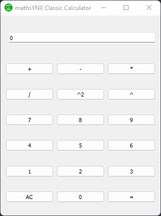

    

# mathsYNX Classic Calculator

    

Classic calculator software using python and pyforms desktop GUI framework.

## How to use the calculator 

Click or enter any calculation into the text input then click on the `=` button to get the calculation's result.
AC button is used to clear all data. 

## Credits

Thanks to the Pyforms desktop GUI framework team, their documentation is currently a mess but there is more than enough 
things to build a small project. It is fast and easy to use, but I regret that this framework is not complex enough to
build advanced apps...

Requirements needed for this application were:

- PyForms~=3.0.0
- pypiwin32~=223
- pywin32~=304